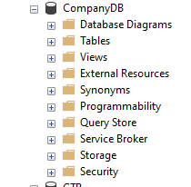
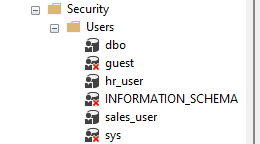
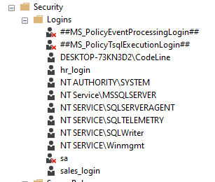

 ## Enforcing Schema-Level Access in a Company Database
 ### Objectives:

 #### 1. Create SQL logins and map them to users inside the database.
 ```sql
-- Step 1: Create the database
CREATE DATABASE CompanyDB;

-- Use the new database
USE CompanyDB

-- Create login and user for HR department
CREATE LOGIN hr_login WITH PASSWORD = 'Hr@2299';
CREATE USER hr_user FOR LOGIN hr_login;

-- Create login and user for Sales department
CREATE LOGIN sales_login WITH PASSWORD = 'Sales@2299';
CREATE USER sales_user FOR LOGIN sales_login;
```







