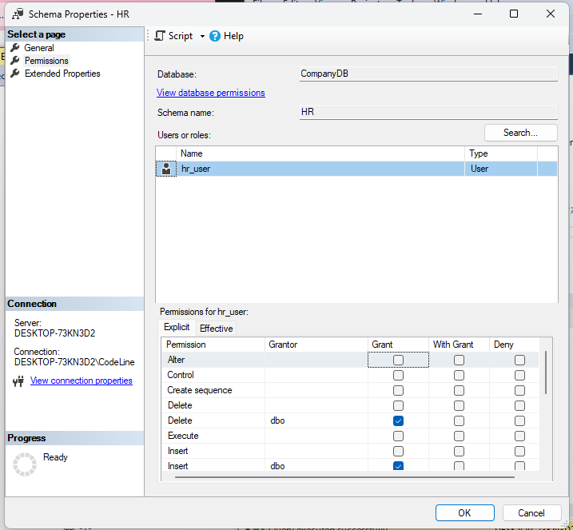

 ## Enforcing Schema-Level Access in a Company Database
 ### Objectives:

 #### 1. Create SQL logins and map them to users inside the database.
 ```sql
-- Step 1: Create the database
CREATE DATABASE CompanyDB;

-- Use the new database
USE CompanyDB

-- Create login and user for HR department
CREATE LOGIN hr_login WITH PASSWORD = 'Hr@2299';
CREATE USER hr_user FOR LOGIN hr_login;

-- Create login and user for Sales department
CREATE LOGIN sales_login WITH PASSWORD = 'Sales@2299';
CREATE USER sales_user FOR LOGIN sales_login;
```


------------------

#### 2. Create two schemas: HR and Sales
 ```sql
-- Create HR schema
CREATE SCHEMA HR;

-- Create Sales schema
CREATE SCHEMA Sales;
```


------------------

#### 3. Create a few sample tables inside each schema.
 ```sql
-- HR.Employees table
CREATE TABLE HR.Employees (
    EmployeeID INT PRIMARY KEY,
    FullName NVARCHAR(100),
    Position NVARCHAR(50),
    HireDate DATE,
    Salary DECIMAL(10, 2)
);

-- HR.Departments table
CREATE TABLE HR.Departments (
    DepartmentID INT PRIMARY KEY,
    DepartmentName NVARCHAR(100),
    ManagerID INT
);

-- Sales.Customers table
CREATE TABLE Sales.Customers (
    CustomerID INT PRIMARY KEY,
    CustomerName NVARCHAR(100),
    Email NVARCHAR(100),
    Region NVARCHAR(50)
);

-- Sales.Orders table
CREATE TABLE Sales.Orders (
    OrderID INT PRIMARY KEY,
    CustomerID INT,
    OrderDate DATE,
    TotalAmount DECIMAL(10, 2),
    FOREIGN KEY (CustomerID) REFERENCES Sales.Customers(CustomerID)
);
```


--------------

### Assign schema-level permissions so:

- HR users cannot access Sales data.
```sql
-- Give HR user full access to HR schema
GRANT SELECT, INSERT, UPDATE, DELETE ON SCHEMA::HR TO hr_user;

-- Prevent HR user from accessing Sales schema
DENY SELECT, INSERT, UPDATE, DELETE ON SCHEMA::Sales TO hr_user;
```


- Sales users cannot access HR data.
```sql
-- Give Sales user full access to Sales schema
GRANT SELECT, INSERT, UPDATE, DELETE ON SCHEMA::Sales TO sales_user;

-- Prevent Sales user from accessing HR schema
DENY SELECT, INSERT, UPDATE, DELETE ON SCHEMA::HR TO sales_user;
```


-------------------

#### Task Output Checklist

#### Try to:

- Connect as hr_login and access HR.Employees


- Try to access Sales.Customers


#### 3. Write a short explanation:
**Why schema-level security is better than table-by-table permissions**
Despite table-by-table permissions require access to each table individually and apply permissions to the entire schema, schema-level security enables permission management at the schema level rather than individual tables.

**How this setup supports data segregation in real-world companies**
By limiting access to each department's data, this configuration guards against illegal access and preserves data integrity.  It makes it possible to clearly separate concerns, which is essential in settings like sales and human resources where sensitive data is handled.

-------------------
## Reflection Report Instructions

### Understanding SQL Security Levels and Real-World Risks
**1. Server-Level Login**
A server-level login connects a user or application to a SQL Server instance, allowing entry into the system using SQL or Windows Authentication.

**2. Database-Level User**
A database user, created using CREATE USER, is a server login that grants access to a specific database, allowing interaction with specific schemas and tables.

**3. Schema-Level Permissions**
A schema is a logical container for database objects, with schema-level permissions allowing or denying access to all within it, making it more efficient than assigning permissions to individual objects.

**4. Object-Level Permissions**
This method controls access to individual objects, such as tables or views, but is more granular and harder to maintain for large systems.


### Benefits of Applying Security Levels 
Layered security in SQL Server offers control, protection, and accountability within a database environment.

**1. Restrict Sensitive Data**
Sensitive data like employee salaries and financial transactions should be restricted to authorized roles through schema-level or object-level security.

**2. Prevent Unauthorized Changes**
Security levels restrict access to critical data, preventing unauthorized modifications. Junior developers are assigned read-only roles to view sales data without modification.

**3. Reduce Human Error**
The principle of least privilege ensures users have access to only what they need, reducing the risk of accidental data deletion or alteration.

**4. Meet Compliance and Audit Requirements**
Implementing strict access controls, such as logging and restricting patient data, ensures compliance with regulations like GDPR, HIPAA, and ISO, supporting internal and external audits.

### Real-World Risks Without Security
**Explain what might happen if:**
- Everyone has full access

Full access to sensitive data, unauthorized users, and lack of clear accountability can lead to security breaches, compromising company policy and privacy laws, as seen in employee sharing.

- Developers Modify Production Data

Developers can accidentally modify production data, create or drop tables in the wrong schema, or modify financial or operational data in real-time systems, leading to data loss.

- Interns Access HR Data

Interns can access confidential HR data, potentially leading to privacy violations and legal repercussions, such as breaching GDPR compliance by sending personal employee data to a friend.

### Task Summary
**• How you created logins, users, and schemas** 

1. Created SQL Logins

```sql
-- Create login and user for HR department
CREATE LOGIN hr_login WITH PASSWORD = 'Hr@2299';
CREATE USER hr_user FOR LOGIN hr_login;
```

2.Mapped Logins to Database Users
```sql
USE CompanyDB;
CREATE USER hr_user FOR LOGIN hr_login;
CREATE USER sales_user FOR LOGIN sales_login;
```

3.Created Schemas for Departments
```sql
-- Create HR schema
CREATE SCHEMA HR;

-- Create Sales schema
CREATE SCHEMA Sales;
```

**- How Schema Permission Limited Access**
```sql
-- HR user can access HR schema
GRANT SELECT, INSERT, UPDATE, DELETE ON SCHEMA::HR TO hr_user;
-- HR user is denied access to Sales schema
DENY SELECT, INSERT, UPDATE, DELETE ON SCHEMA::Sales TO hr_user;

-- Sales user can access Sales schema
GRANT SELECT, INSERT, UPDATE, DELETE ON SCHEMA::Sales TO sales_user;
-- Sales user is denied access to HR schema
DENY SELECT, INSERT, UPDATE, DELETE ON SCHEMA::HR TO sales_user;
```


**- How this applies to real companies**

How Actual Companies Are Affected by This Departments like HR, Finance, Sales, and IT manage sensitive and unique data in real-world businesses.  Without appropriate access control:

 1. Executive salaries could be viewed by an HR intern.

 2. Employee records could be inadvertently erased by a sales representative.

 3. By testing directly in production databases, a developer could introduce bugs.

 **Data specific to a department has distinct boundaries thanks to schema-level security.**

 - Scalability: Rather than granting or denying access to specific tables, grant or revoke access to entire schemas.

 - adherence to data protection laws (such as HIPAA and GDPR).

 - Make sure that only authorized roles handle sensitive data to ensure audit readiness.

 -------------------
 ## Security Scenario: When Access Goes Wrong

 ### Summary of the Problems
 **1.Accidental Data Deletion**

 Instead of using the test environment, Adil accidentally executed DELETE FROM Employees on the live production database.

Because no backup was made in advance, the data was permanently lost.

**2.Salary Data Leak**

Adil produced a report with private salary data in it.

He violated company policy and privacy when he unintentionally shared the file with an outside UI developer.

**3.Unauthorized Role Creation**

Without permission, Adil made a new SQL login for a junior developer.

That junior developer had unrestricted access to private HR information.

**4.Schema Confusion**

Rather than using the HR schema, Adil made new tables using the default DBO schema.

Team operations were disrupted when HR staff were unable to access them because of missing permissions.

### Root Causes (Security Flaws)
- No distinction between production and development

 - Live data was directly accessible to developers.

 - For safe testing, there were no isolated environments available.

- Developers are granted complete access.

- Adil was authorized to view sensitive data and carry out high-risk tasks like DELETE and CREATE LOGIN.

 - Absence of schema-level limitations

 - Confusion and access problems resulted from Adil's ability to create and alter objects in any schema.

 - Absence of permission control based on roles

 - Roles like ReadOnly, DataEntry, and DevOps are not used.

 - Individuals were given privileges at random.

